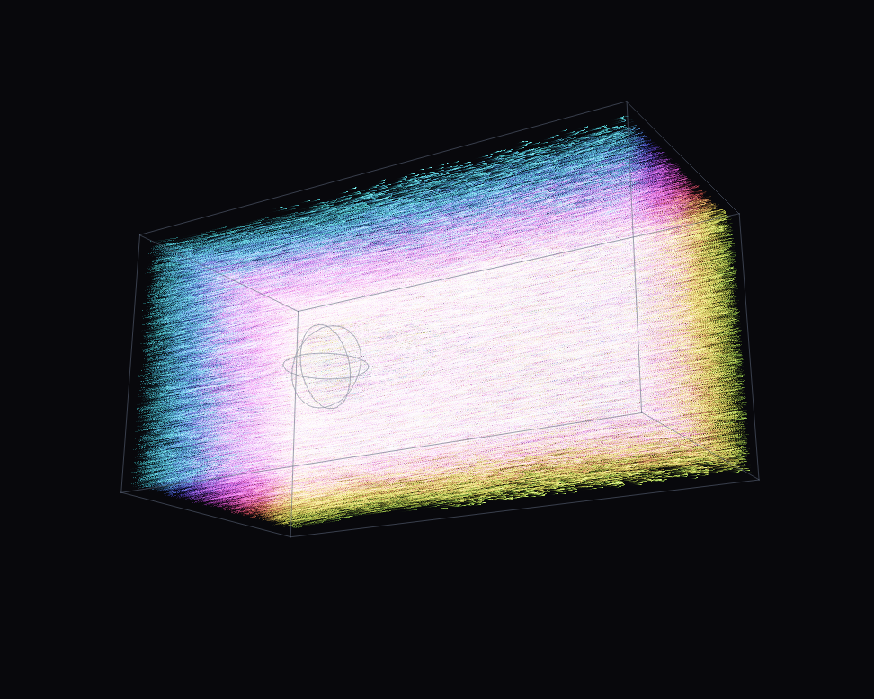

# FlowTracer

[](https://github.com/sponsors/makarov-mm)
[](LICENSE)


[](https://www.linkedin.com/in/makarov-mm/)
[](https://www.threads.net/@m.m.makarov)
[](https://www.instagram.com/m.m.makarov/)

3D lattice Boltzmann: channel flow past a sphere, made visible with hundreds
of thousands of glowing tracer particles and an orbit camera.

## Screenshot



## Physics

D3Q19 lattice — nineteen velocity directions per cell, BGK collision with an
optional **Smagorinsky LES** model. In 3D at interesting Reynolds numbers the
grid can no longer resolve the smallest turbulent eddies and plain BGK blows
up. Smagorinsky computes the non-equilibrium stress tensor `Π` directly from
the distribution functions (a perk of LBM: no finite differences needed),
derives a local eddy viscosity from it, and adjusts the relaxation rate per
cell:

```
tau_eff = (tau0 + sqrt(tau0² + 18·√2·Cs²·|Π|/rho)) / 2
```

Under-resolved turbulence is absorbed instead of accumulating into an
explosion.

Obstacles: sphere, z-cylinder or cube, slightly off-center to break symmetry.
Half-way bounce-back walls, fixed-equilibrium inlet, zero-gradient outlet.
Grids 96×48×48 / 128×64×64 / 160×80×80.

## Visualization

Up to 500k massless tracers are advected through the velocity field (trilinear
sampling) and rendered as glowing points into a float accumulation buffer with
per-frame decay — trails — and `1 - exp(-x)` tone mapping. Domain wireframe and
obstacle silhouette are drawn on top.

Color modes:

- **Stripes** — hue by injection height. The flow enters as neat rainbow
  strata; the wake behind the sphere twists and mixes the layers. The most
  telling mode: you watch stirring happen.
- **Speed** — velocity magnitude ramp.
- **Vorticity** — local |curl u| from neighboring cells.

## Controls

| Control | Effect |
|---|---|
| LMB drag | orbit camera |
| Wheel | zoom |
| Grid / Obstacle / Obstacle R | scene setup (resets flow) |
| Omega, Inflow u0 | Reynolds number |
| Smagorinsky LES + Cs | subgrid model |
| Tracers / Trail decay / Brightness | visualization |
| Color | stripes / speed / vorticity |

## Build

```
cmake -B build -DCMAKE_BUILD_TYPE=Release
cmake --build build -j
```

Requires Qt6. C++17, Qt6 Widgets only, multithreaded on `std::thread`.
3D is compute-hungry: on a weak machine start with the 96×48×48 preset and
fewer steps/frame. This project is also the most natural candidate for a
CUDA/Metal compute backend.

## Debug frame dump

`DUMP_FRAMES=N` renders N frames headlessly, saves `dump.png`, exits.

## License

MIT License

Copyright (c) 2026 Mykhailo Makarov

Permission is hereby granted, free of charge, to any person obtaining a copy
of this software and associated documentation files (the "Software"), to deal
in the Software without restriction, including without limitation the rights
to use, copy, modify, merge, publish, distribute, sublicense, and/or sell
copies of the Software, and to permit persons to whom the Software is
furnished to do so, subject to the following conditions:

The above copyright notice and this permission notice shall be included in all
copies or substantial portions of the Software.

THE SOFTWARE IS PROVIDED "AS IS", WITHOUT WARRANTY OF ANY KIND, EXPRESS OR
IMPLIED, INCLUDING BUT NOT LIMITED TO THE WARRANTIES OF MERCHANTABILITY,
FITNESS FOR A PARTICULAR PURPOSE AND NONINFRINGEMENT. IN NO EVENT SHALL THE
AUTHORS OR COPYRIGHT HOLDERS BE LIABLE FOR ANY CLAIM, DAMAGES OR OTHER
LIABILITY, WHETHER IN AN ACTION OF CONTRACT, TORT OR OTHERWISE, ARISING FROM,
OUT OF OR IN CONNECTION WITH THE SOFTWARE OR THE USE OR OTHER DEALINGS IN THE
SOFTWARE.

## Support

If you found this project interesting or useful, you can support my work:

[](https://github.com/sponsors/makarov-mm)
